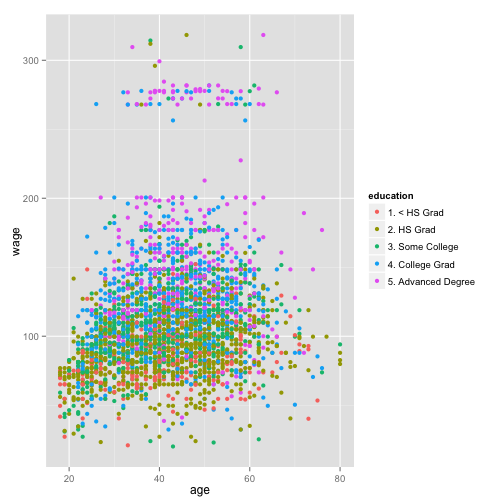
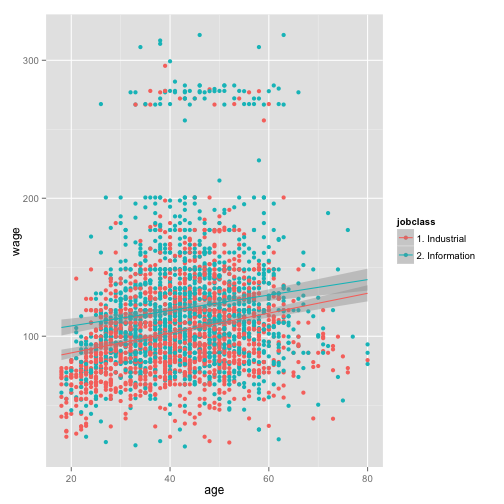

Wages Shiny App Presentation
========================================================
author: Gaurav Garg (gaurav_garg@yahoo.com)
date: Jul 26th, 2015

Building a Shiny App
========================================================
The Wage Explorer is a Shiny App, deployed on the Shiny server. 
https://kinatus.shinyapps.io/Project

The App is built to visually present the data from the Wages data in the ISLR package. The app showcases the following aspects.
- How to create a simple Shiny App
- Creating a Plot from the Wages data
- Using the Inputs and Outputs to build interactive User Experience
- Integrating Calculations within the HTML page

Wage Dataset 
========================================================
Wage dataset in the ISLR package has Wage and other data for a group of 3000 workers in the Mid-Atlantic region. Use the summary() to review the basic charecterstics.

```r
library(ISLR)
library(ggplot2)
summary(Wage)
```

```
      year           age               sex                    maritl    
 Min.   :2003   Min.   :18.00   1. Male  :3000   1. Never Married: 648  
 1st Qu.:2004   1st Qu.:33.75   2. Female:   0   2. Married      :2074  
 Median :2006   Median :42.00                    3. Widowed      :  19  
 Mean   :2006   Mean   :42.41                    4. Divorced     : 204  
 3rd Qu.:2008   3rd Qu.:51.00                    5. Separated    :  55  
 Max.   :2009   Max.   :80.00                                           
                                                                        
       race                   education                     region    
 1. White:2480   1. < HS Grad      :268   2. Middle Atlantic   :3000  
 2. Black: 293   2. HS Grad        :971   1. New England       :   0  
 3. Asian: 190   3. Some College   :650   3. East North Central:   0  
 4. Other:  37   4. College Grad   :685   4. West North Central:   0  
                 5. Advanced Degree:426   5. South Atlantic    :   0  
                                          6. East South Central:   0  
                                          (Other)              :   0  
           jobclass               health      health_ins      logwage     
 1. Industrial :1544   1. <=Good     : 858   1. Yes:2083   Min.   :3.000  
 2. Information:1456   2. >=Very Good:2142   2. No : 917   1st Qu.:4.447  
                                                           Median :4.653  
                                                           Mean   :4.654  
                                                           3rd Qu.:4.857  
                                                           Max.   :5.763  
                                                                          
      wage       
 Min.   : 20.09  
 1st Qu.: 85.38  
 Median :104.92  
 Mean   :111.70  
 3rd Qu.:128.68  
 Max.   :318.34  
                 
```

Plot from Wages data
========================================================
The Wage Exploer app uses the qplot() to visualize the data from the dataset. We will use the colour parameter in the qplot() to give user some options.

 

Lets see what the plot should look like with datapoints coloured by the education. 

User Interface - Inputs and Outputs
========================================================
I use the radioButtons() in Shiny inputs to set which column should be used for the colour parameter. in UI.r, variable varGroupBy is assigned 1 (no Group By), 2 (Job classification) or 3 (education).

Similarly, variable varRegressionLines is assigned a TRUE/FALSE value from the checkbox to add regression lines to the plot.

```r
#sample input value. These values should be set in UI.R
varGroupBy <- 2
varRegressionLines <- TRUE

# Conditional code in Server.R
if(varGroupBy == 1) # no grouping selected in the UI
       { p <- qplot(age,wage,data=Wage)}
if (varGroupBy == 2) # Group the datapoints by Job Class
        {p <- qplot(age,wage, colour=jobclass,data=Wage)}
if (varGroupBy == 3) # Group the datapoints by Education
        {p <- qplot(age,wage,colour=education,data=Wage)}

# did the user select the option the add the regression lines?                        
if (varRegressionLines)
        p <- p+geom_smooth(method='lm',formula=y~x)
        
p
```

 

Calculation Piece
========================================================
Course requires use to take an input, do some calculations and display the result back in the HTML. I use the SampleSize from the slider input to calculation the training set size.

```r
#UI.r will set the value of SampleSize
sampleSize <- 1500

# Calculate the training set size. By default the value of sampleSize variable is set to 1500
paste("You have selected sample size of ",sampleSize,
                      " which results in a training set of", 
                      round((sampleSize/nrow(Wage)*100),2),
                      "%.")
```

```
[1] "You have selected sample size of  1500  which results in a training set of 50 %."
```
